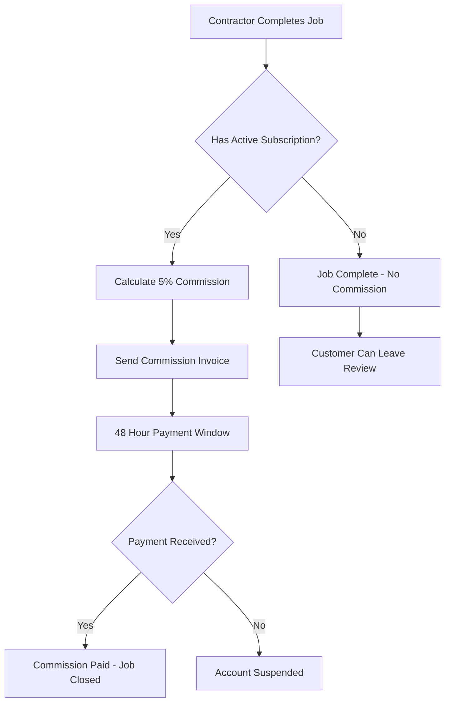

# Commission and Subscription System

## Overview

TrustBuild now supports a comprehensive subscription and commission system that distinguishes between subscribed and non-subscribed contractors.

## Subscription Plans

### Available Plans
1. **Monthly**: £49.99/month
2. **6-Month**: £269.94 (£44.99/month) - 10% discount
3. **Yearly**: £479.88 (£39.99/month) - 20% discount

### Subscription Benefits
- Access to commission-based jobs
- No upfront job access fees (pay commission only after winning)
- Priority job visibility
- Enhanced profile features

## Commission System (Subscribed Contractors Only)

### How It Works

1. **Job Completion**: Contractor marks job as completed with final agreed amount
2. **Commission Calculation**: 5% commission (VAT included in amounts)
3. **48-Hour Payment Window**: Contractor has exactly 48 hours to pay commission
4. **Automatic Suspension**: Account suspended if payment not received on time

### Commission Calculation Example
```
Final Job Amount: £1,000
Commission (5%):  £50
VAT (included):   £0
Total Due:        £50
```

### Payment Timeline
```
Job Completed → Commission Invoice Sent → 48 Hours → Account Suspended
     ↓                    ↓                  ↓              ↓
   Day 0               Day 0             Day 2         Suspended
```

## Email Notification System

### Commission Invoice Email
- **Sent**: Immediately when job is marked complete
- **Content**: Invoice details, payment instructions, suspension warning
- **Urgency**: High priority with clear payment deadline

### Reminder Emails
Automatic reminders sent at:
- **36 hours** before due date
- **24 hours** before due date  
- **12 hours** before due date
- **6 hours** before due date
- **2 hours** before due date (FINAL WARNING)

### Account Suspension
- **Automatic**: Triggered when payment deadline passes
- **Effects**: 
  - Loss of job access
  - Profile hidden from customers
  - Cannot purchase new job leads
  - Must pay all outstanding commissions + reactivation fee

## Non-Subscribed Contractors

### How It Works
- **Pay per job access**: Traditional lead purchasing model
- **No commission**: Can receive reviews but no 5% commission applies
- **Immediate access**: Pay upfront for customer contact details

### Benefits
- No monthly subscription fees
- No commission on completed jobs
- Flexible usage model

## API Endpoints

### Commission Management
```bash
# Mark job as completed (triggers commission for subscribed contractors)
POST /api/payments/complete-job
{
  "jobId": "job_123",
  "finalAmount": 1000.00
}

# Get contractor's commission payments
GET /api/payments/commissions?page=1&limit=10

# Create payment intent for commission
POST /api/payments/create-commission-payment-intent
{
  "commissionPaymentId": "comm_123"
}

# Pay commission
POST /api/payments/pay-commission
{
  "commissionPaymentId": "comm_123",
  "stripePaymentIntentId": "pi_123"
}
```

### Subscription Management
```bash
# Check subscription status
GET /api/contractors/subscription

# Create subscription
POST /api/contractors/subscribe
{
  "plan": "MONTHLY", // or "SIX_MONTHS", "YEARLY"
  "tier": "PREMIUM"
}

# Cancel subscription
POST /api/contractors/cancel-subscription
```

## Database Schema

### CommissionPayment Model
```sql
- id: String (Primary Key)
- jobId: String (Unique, Foreign Key)
- contractorId: String (Foreign Key)
- customerId: String (Foreign Key)
- finalJobAmount: Decimal
- commissionRate: Decimal (Default: 5.00)
- commissionAmount: Decimal
- vatAmount: Decimal
- totalAmount: Decimal
- status: CommissionStatus (PENDING, PAID, OVERDUE, WAIVED)
- dueDate: DateTime
- paidAt: DateTime?
- stripePaymentId: String?
- remindersSent: Int
- lastReminderSent: DateTime?
```

### Subscription Model
```sql
- id: String (Primary Key)
- contractorId: String (Unique, Foreign Key)
- tier: ContractorTier
- plan: SubscriptionPlan (MONTHLY, SIX_MONTHS, YEARLY)
- monthlyPrice: Decimal
- stripeSubscriptionId: String?
- status: String (active, cancelled, past_due, etc.)
- isActive: Boolean
- currentPeriodStart: DateTime
- currentPeriodEnd: DateTime
```

## Automated Tasks

### Commission Reminder Service
```javascript
// Run every hour
processCommissionReminders()
```

This service:
1. Checks all pending commission payments
2. Sends reminder emails at specified intervals
3. Suspends accounts for overdue payments
4. Updates reminder counters

### Setup Cron Job
```bash
# Add to crontab (run every hour)
0 * * * * node /path/to/commission-cron.js
```

## Business Logic

### Subscription vs Non-Subscription Flow



### Payment Methods Supported
- ✅ Visa
- ✅ MasterCard  
- ✅ American Express
- ✅ Apple Pay
- ✅ Google Pay

## Revenue Model

### For TrustBuild
1. **Subscription Revenue**: Monthly/yearly subscription fees
2. **Lead Revenue**: Non-subscribed contractors paying per job access
3. **Commission Revenue**: 5% commission from completed jobs

### For Contractors
#### Subscribed:
- Monthly subscription fee
- 5% commission on completed jobs
- No upfront job access costs

#### Non-Subscribed:
- Pay per job access (£15-£50 depending on job size)
- No commission on completed jobs
- No monthly fees

## Testing

### Test Commission Flow
```bash
# 1. Complete a job
POST /api/payments/complete-job
{
  "jobId": "test_job",
  "finalAmount": 100.00
}

# 2. Check commission created
GET /api/payments/commissions

# 3. Test payment flow
POST /api/payments/create-commission-payment-intent
{
  "commissionPaymentId": "generated_id"
}
```

### Test Subscription
```bash
# Create test subscription
POST /api/contractors/subscribe
{
  "plan": "MONTHLY",
  "tier": "PREMIUM"
}
```

## Compliance and Legal

### Invoice Requirements
- ✅ VAT calculation (20%)
- ✅ Unique invoice numbers
- ✅ Contractor and company details
- ✅ Payment terms (48 hours)
- ✅ Professional formatting

### Data Protection
- ✅ Secure payment processing via Stripe
- ✅ Encrypted email communications
- ✅ GDPR compliant data handling
- ✅ Audit trail for all transactions

## Monitoring and Analytics

### Key Metrics to Track
- Subscription conversion rates
- Commission payment compliance
- Account suspension rates  
- Revenue per contractor
- Churn rates by plan type

### Dashboard Views
- Outstanding commission payments
- Subscription renewals due
- Suspended accounts needing reactivation
- Revenue breakdown by source
